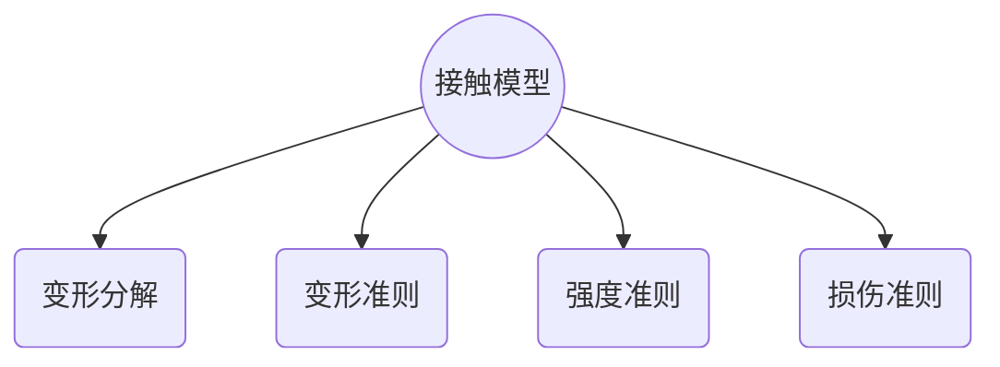

# bpm

## 接触模型



<!-- more -->

## 运动与变形分解

运动 = 刚体运动 + 变形

按变形形式：

    变形 = 平动变形(质点) + 转动变形(质点系)

按变形方向：

    变形 = 法向变形 + 切向变形

两两组合：拉/压，弯，剪，扭

## 平行粘结模型

颗粒A与颗粒B，记中心坐标$\vec{c_1}, \vec{c_2}$，半径$r_1, r_2$。


颗粒**A锁定**，记颗粒B平动速度$\vec{v}$，自旋速度$\vec{\omega}$。

A-B接触对，主轴$\vec{n}=\vec{c_2}-\vec{c_1}$，接触点坐标$\vec{c_0}=\alpha\vec{c_1}+(1-\alpha)\vec{c_2}, 其中\alpha=\frac{r_1}{r_1+r_2}$。

$$
\vec{x}_c=\frac{r_1}{r_1+r_2}\vec{x}_2+\frac{r_2}{r_1+r_2}\vec{x}_1\\
\vec{v}_c=\frac{d\vec{x}_c}{dt}=\frac{r_1}{r_1+r_2}\vec{v}_2+\frac{r_2}{r_1+r_2}\vec{v}_1\\
\\
\vec{v}_n=\frac{(\vec{v}_2-\vec{v}_1)\cdot(\vec{x}_2-\vec{x}_1)}{(\vec{x}_2-\vec{x}_1)\cdot(\vec{x}_2-\vec{x}_1)}(\vec{x}_2-\vec{x}_1)
\\
\vec{v}_c^1=\vec{v}_1+\vec{w}_1\times(\vec{x}_2-\vec{x_1})\frac{r_1}{r_1+r_2}\\
\vec{v}_c^2=\vec{v}_2+\vec{w}_2\times(\vec{x}_1-\vec{x_2})\frac{r_2}{r_1+r_2}
\\
\vec{v}_c^2-\vec{v}_c^1=\vec{v}_2-\vec{v}_1+(\frac{r_2\vec{w}_2+r_1\vec{w}_1}{r_1+r_2})\times(\vec{x}_1-\vec{x}_2)
$$

记迭代时间步*dt*

## 转动分解——四元数

**转动分解**：法向 + 切向

$$
\mathbf{q} = a+\vec{b},\mathbf{q}=\mathbf{q_s}*\mathbf{q_n}\\
\mathbf{q_n}=a_n+\vec{b_n},\mathbf{q_s}=a_s+\vec{b_s}
$$

**注意**：四元数乘法不满足交换律

$$
%1.
\mathbf{q_s}*\mathbf{q_n}=
a_sa_n-\vec{b_s}\cdot\vec{b_n}+
a_s\vec{b_n}+a_n\vec{b_s}+\vec{b_s}\times\vec{b_n}\\
\\%2.
\vec{b_n}\perp\vec{b_s}\\
\Rightarrow\vec{b_n}\times\vec{b_s}\neq\vec{0},
\mathbf{q_n}*\mathbf{q_s}\neq\mathbf{q_s}*\mathbf{q_n}\\
\Rightarrow \vec{b_n}\cdot\vec{b_s}=0,
a=a_na_s,\cos(\theta/2)=\cos(\theta_n/2)\cos(\theta_s/2)
$$

**转动分解的求解**：绕转轴的转动 ($\mathbf{q_n}$) + 转轴自身的转动($\mathbf{q_s}$)

记绕$\vec{v}$转动角度$\theta\in[0,\pi]$，法向量$\vec{n}$，则有：

$\mathbf{q}=\cos{\theta/2}+\sin{\theta/2}\cdot\vec{v}$

$$
\vec{n}=\mathbf{q}*\vec{n}*\mathbf{q}^{-1}=\mathbf{q_s}*\vec{n}*\mathbf{q_s}^{-1}
$$


校验：

$$
\vec{b_n}=a_s
$$

弯曲的剪切分量

$$
\mathbf{q}_1,\mathbf{q}_2\\
\mathbf{q}_1=\mathbf{q}_s*\mathbf{q}_t,\mathbf{q}_2=\mathbf{q}_s*\mathbf{q}_t^{-1}\\
\Rightarrow \mathbf{q}_t=(\mathbf{q}_2^{-1}*\mathbf{q}_1)^{1/2}\\
\mathbf{q}_s=\mathbf{q}_1*\mathbf{q}_t^{-1}
$$

$\vec{\theta}=[\theta_x,\theta_y,\theta_z],\vec{\delta}=[\delta_x,\delta_y,\delta_z]$

全量法 vs. 增量法

```matlab
function R = getRadius(mo,varargin)
%GETRADIUS get radius of IBall or nBall
%	IR = getRadius(mo, mId)
%	JR = getRadius(mo, nBall)
%
%	RIJ = getRadius(mo, mId, nBall, fh)
%   function handle of operations usually:
%		@(I,J)(J+I), @(I,J)(J-I),
%		@(I,J)(I.*J)./(I+J), @(I,J)min(I,J)
%	default: fh == @(I,J)(I.*J)./(I+J)

if nargin==2
	idx = varargin{1}; 
	R = mo.aR(idx);
	return
end

IR = mo.aR(varargin{1})
JR = mo.aR(varargin{2})
fh = @(I, J)(I.*J)./(I+J);
if nargin==4
	fh = varargin{3};
end

R = feval(fh, IR, JR);
end

function v = getIJScalar(V,varargin)
%GETRADIUS get value of IBall or nBall
%	IR = getIJScalar(mo, mId)
%	JR = getIJScalar(mo, nBall)
%
%	RIJ = getIJScalar(mo, mId, nBall, fh)
%   function handle of operations usually:
%		@(I,J)(J+I), @(I,J)(J-I),
%		@(I,J)(I.*J)./(I+J), @(I,J)min(I,J)
%	default: fh == @(I,J)(J-I)

if nargin==2
	idx = varargin{1}; 
	v = V(idx);
	return
end

IV = V(varargin{1})
JV = V(varargin{2})
fh = @(I, J)(J-I);
if nargin==4
	fh = varargin{3};
end

v = feval(fh, IV, JV);
end

function v = getIJVector(V,varargin)
%GETRADIUS get value of IBall or nBall
%	IR = getIJVector(mo, mId)
%	JR = getIJVector(mo, nBall)
%
%	RIJ = getIJVector(mo, mId, nBall, fh)
%   function handle of operations usually:
%		@(I,J)(J+I), @(I,J)(J-I),
%		@(I,J)(I.*J)./(I+J), @(I,J)min(I,J)
%	default: fh == @(I,J)(J-I)

v=cell(1,size(V,2));
for ii=1:size(V,2)
    v{ii} = getIJScalar(V(:,ii), varargin{:});
end

v = cat(3,v{:});
end
```
