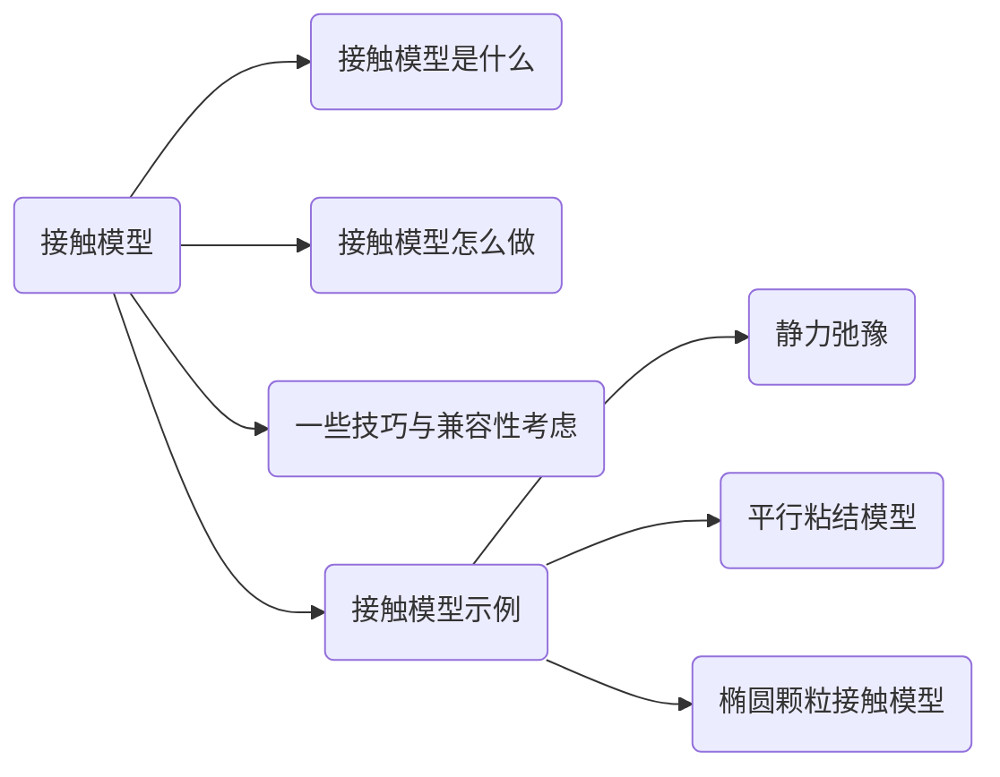

# 自定义接触模型的开发、调试与验证

## 静力弛豫“接触模型“

记颗粒$P$中心$\vec{x}_0$，半径$r_0$；区域$\Omega:f(\vec{x})\le0$，边界$\partial\Omega:f(\vec{x})=0$。

在$\vec{x}_0$处的梯度方向：$\vec{n}=\frac{\nabla{f(\vec{x}_0)}}{||\nabla{f(\vec{x}_0)}||}$
$$
d_0=f(\vec{x}_0),d_1=f(\vec{x}_0-\mathrm{sign}(d_0)\cdot{r}\cdot\vec{n})\\
\\
d_{\alpha}=f(\vec{x}_0-\alpha\cdot\mathrm{sign}(d_0)\cdot{r}\cdot\vec{n})\\
\approx (1-\alpha)\cdot d_0+\alpha\cdot d_1=0\\
\Rightarrow\alpha=\frac{d_0}{d_0-d_1}\\\\
\delta{\vec{x}}=-\frac{d_0}{d_0-d_1}\cdot\mathrm{sign}(d_0)\cdot{r}\cdot\vec{n}-r\cdot\vec{n}
\\=-(1+\frac{|d_0|}{d_0-d_1})\cdot{r}\cdot\vec{n}
\\\\
\mathrm{If}\quad d_0<0 \quad\mathrm{and}\quad d_1<0,\mathrm{Then}\quad P\in\Omega\\\delta{\vec{x}}=\vec{0}
$$

## 颗粒DDA

线性方程组的构建，matrix-free
$$
Ax=b\\
sum(nK.*x(nBall).*nFilter,2)=b
$$
子矩阵：弹性、初始应力、集中力、体积荷载、惯性力、固定位移

## 平行粘结模型

## 椭圆颗粒接触模型

The common normal method:
$$
\begin{cases}
\nabla{f}_1(\mathbf{c}_1)+\mu^2(\mathbf{c}_2-\mathbf{c}_1)=0\\
\nabla{f}_2(\mathbf{c}_2)+\nu^2(\mathbf{c}_1-\mathbf{c}_2)=0\\
f(\mathbf{c}_1)=0\\f(\mathbf{c}_2)=0\\
\end{cases}
$$

$$
\mathbf{c}=\frac{\mathbf{c}_1+\mathbf{c}_2}{2},\delta=||\mathbf{c}_1-\mathbf{c}_2||
\\
d(\mathbf{x}_1,\mathbf{x}_2)=\max_{\mathbf{x}_1\in\Gamma_1}\{\min_{\mathbf{x}_2\in\Gamma_2}||\mathbf{x}_2-\mathbf{x}_1||\}
$$

Solution procedure:

(1) Obtain the unit normal direction $\mathbf{n}$ as the primary variables;

(2) Introduce two angles $\alpha_1$ and $\alpha_2$ as parameters, $\mathbf{n}=\mathbf{n}(\alpha_1,\alpha_2)$;

(3) $\mathbf{x}_1(\alpha_1,\alpha_2)$ and $\mathbf{x}_1(\alpha_1,\alpha_2)$ ca be explicitly expressed;

(4) Minimising the distance $d(\alpha_1,\alpha_2)=||\mathbf{x}_1-\mathbf{x}_2||$.

Combine Newton-Raphson and Levenberg-Marquardt method

$$
\begin{cases}
\mathrm{Ellipse\ 1:\quad}\frac{x^2}{a_1^2}+\frac{y^2}{b_1^2}=1,\mathbf{o}_1,\mathbf{q}_1\\
\mathrm{Ellipse\ 2:\quad}\frac{x^2}{a_2^2}+\frac{y^2}{b_2^2}=1,\mathbf{o}_2,\mathbf{q}_2\\
\mathrm{Initial\ normal\ vector:}\quad \mathbf{n}=(n_x,n_y)\\
\end{cases}
$$
Contact point:
$$
\mathbf{c}_1=\mathbf{o}_1+
\begin{bmatrix}
\frac{a_1^2n_x}{\sqrt{a_1^2n_x^2+b_1^2n_y^2}}&\frac{b_1^2n_y}{\sqrt{a_1^2n_x^2+b_1^2n_y^2}}\\
\end{bmatrix}\\

\mathbf{c}_2=\mathbf{o}_2-
\begin{bmatrix}
\frac{a_2^2n_x}{\sqrt{a_2^2n_x^2+b_2^2n_y^2}}&\frac{b_2^2n_y}{\sqrt{a_2^2n_x^2+b_2^2n_y^2}}\\
\end{bmatrix}\\

\mathbf{c}=\mathbf{c}_2-\mathbf{c}_1\\
\mathbf{c}_n=\frac{\mathbf{c}\cdot\mathbf{n}}{\mathbf{n}\cdot\mathbf{n}}\mathbf{n}\\
\\
1.\ \mathbf{c}\cdot\mathbf{n}>0,\quad \mathrm{No\ contact}\\
\mathbf{n}=\mathbf{n}+\frac{\mathbf{c}\cdot\mathbf{n}}{\mathbf{c}\cdot\mathbf{c}}\mathbf{c}
$$

Step (3): support point function

Initial guess and Temporal coherence

No contact cases, detect as soon as possible

## Contact modelling of mixed pairs of shapes

1. Unified polygonal/polyhedral contact modelling approach

2. Minkowski-difference based contact modelling approach

   (1). Minkowski difference
   $$
   A \ominus B = {\mathbf{a-b}:\mathbf{a} \in A,\mathbf{b} \in B}
   \\ A \ominus B = A \oplus (-B)\\
   A \cap B = \empty \Longleftrightarrow \mathbf{o} \in A \ominus B
   $$
   convex + convex must be convex, convex hull of boundary/vertex sum

   (2). Support point/function
   
   additive.No contact :
   $$
   \mathbf{v}\cdot\mathbf{p}_s(A \ominus B,\mathbf{v})<0
   $$
   (3) GJK algorithm

## The ECC theory and the general contact model

- *Principle*: the total mechanical energy conserved before and after any elastic impact.

- *Assumption*: contact energy potential function *w*
  $$
  w=w(\mathbf{x}_o,\mathbf{x}_o^{'},\mathbf{\theta},\mathbf{\theta}^{'},\mathbf{\Phi})\\
  \mathbf{F}_n=-\frac{\partial{w}}{\partial\mathbf{x}_0}\\
  \mathbf{M}_n=-\frac{\partial{w}}{\partial\mathbf{\theta}_0}
  $$

  $$
  \mathbf{n}=\mathbf{F}_n/F_n,\quad F_n=||\mathbf{F}_n||\\
  \mathbf{M}_n=(\mathbf{x}_c-\mathbf{x}_o)\times\mathbf{F}_n\\
  \Rightarrow\quad \mathbf{x}_c=\mathbf{x}_o+\frac{\mathbf{n}\times\mathbf{M}_n}{||F_n||}+\lambda\mathbf{n}
  $$

  

Coordinate invariant

1. **The contact-volume based ECC model**
   $$
   w=w(V_c)\\
   \mathbf{F}_n=-\frac{\partial w(V_c)}{\partial \mathbf{x}_o}\mathbf{S}_n,\quad\mathrm{with}\ \mathbf{S_n}=\int_{S_1}{d\mathbf{S}}=\frac{1}{2}\oint_\Gamma{\mathbf{x}\times d{\Gamma}}\\
   \mathbf{x}_c=\frac{\mathbf{n}\times\mathbf{G}_n}{S_n}+\lambda\mathbf{n},\quad \mathrm{with}\ \mathbf{G}_n=\int_{S_1}{\mathbf{x}\times d\mathbf{S}}=-\frac{1}{3}\oint_\Gamma{\mathbf{x}\cdot\mathbf{x} d{\Gamma}}\\
   \\
   \mathrm{Linear\ function\ of\ Vc\ recommended\ ,thus:}\\
   F_n=k_nS_n
   $$
   

   Naturally additive, summate all the sub-domain values.

   flexible and highly paralleisable

   universal solution: volumetric or surface triangular meshes

   ray tracing, dual approach, GJK 

2. **The contact-overlap based ECC model**

   A unified overlap: Minkowski overlap
   $$
   A^{\mathbf{v}}\equiv A\oplus\{\mathbf{v}\}=\{\mathbf{a}+\mathbf{v}:\mathbf{a}\in A\}\\
   \mathbf{d}_M=\mathrm{argmin}_{\mathbf{v}\in\R^n}\{||\mathbf{v}||:\mathbf{o}\in\partial(A\ominus B^{\mathbf{v}})\}\\
   \mathbf{d}_M=\delta_M\mathbf{n}=\mathbf{c-o}=\mathbf{c_1-c_2}\\
   \frac{\partial\mathbf{c}}{\partial\mathbf{x}}=-\mathbf{I}\\
   \frac{\partial\delta_M}{\partial\mathbf{x}}=-\mathbf{n}_M
   $$
   

Minkowski overlap based ECC model
$$
w=w(\delta)\\
\mathbf{F}_n=-\frac{\partial w(\delta)}{\partial\mathbf{x}}=w^{'}(\delta)\mathbf{n}_M
$$
the combined GJK and EPA method

Conclusions: 

1. all common-normal contact models are energy-conserving;
2. the level-set method is also energy conserving;
3. the original common-plane and fast common-plane methods cannot guarantee enenrgy conserving.

## 颗粒与三角形的接触关系

三角形$\triangle ABC$与颗粒$(P,r)$
$$
\vec{v}_1=\vec{OB}-\vec{OA},\quad \vec{v}_2=\vec{OC}-\vec{OA},\quad\vec{n}=\vec{v}_1\times\vec{v}_2\\
\\
\vec{v}_p=\vec{OP}-\vec{OA}=\alpha\vec{v}_1+\beta\vec{v}_2+\lambda\vec{n}
=[\vec{v}_1,\vec{v}_2,\vec{n}]*[\alpha,\beta,\lambda]^T\\
M=[\vec{v}_1,\vec{v}_2,\vec{n}]\\
\Rightarrow [\alpha,\beta,\lambda]^T=M^{-1}*\vec{v}_p=(M^T*M)^{-1}*(M^T*\vec{v}_p)\\
\\
M^T*M=
\begin{bmatrix}
\vec{v}_1\cdot\vec{v}_1&\vec{v}_1\cdot\vec{v}_2&0\\
\vec{v}_2\cdot\vec{v}_1&\vec{v}_2\cdot\vec{v}_2&0\\
0&0&\vec{n}\cdot\vec{n}\\
\end{bmatrix}\\
()^{-1}\approx
\begin{bmatrix}
-\vec{v}_2\cdot\vec{v}_2&\vec{v}_2\cdot\vec{v}_1&0\\
\vec{v}_1\cdot\vec{v}_2&-\vec{v}_1\cdot\vec{v}_1&0\\
0&0&\vec{n}\cdot\vec{n}
\end{bmatrix}\\
\\
\begin{cases}
t=(\vec{v}_1\cdot\vec{v}_2)^2-(\vec{v}_1)^2\cdot(\vec{v}_2)^2\\
\alpha=\frac{1}{t}(-(\vec{v}_2)^2 (\vec{v}_1\cdot\vec{v}_p)+
(\vec{v}_2\cdot\vec{v}_1) (\vec{v}_2\cdot\vec{v}_p))\\
\beta=\frac{1}{t}(-(\vec{v}_1)^2(\vec{v}_2\cdot\vec{v}_p)+(\vec{v}_1\cdot\vec{v}_2)(\vec{v}_1\cdot\vec{v}_p))\\
\lambda=\frac{\vec{n}\cdot\vec{v}_p} {\vec{n}\cdot\vec{n}}\\
\end{cases}
$$
