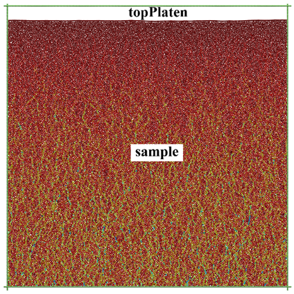
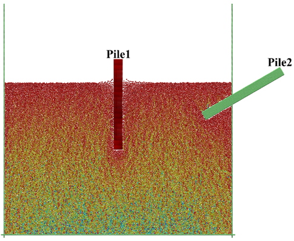
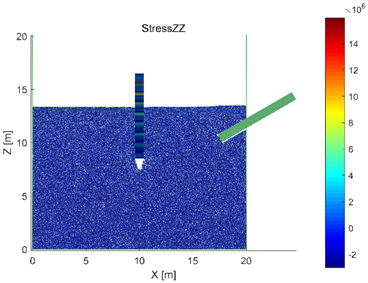
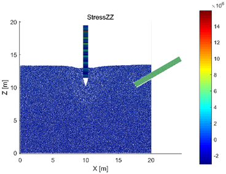

# 桩土作用
压桩和拔桩均涉及到大变形破坏和动态过程，离散元数值模拟能有效地模拟这一过程，并为研究和设计提供参考。MatDEM提供的示例代码<a href="">BoxPile</a>演示了如何建立最简单的桩土作用模型，使用者可在此基础之上建立更加复杂的模型。

## 堆积地层模型
在BoxPile1中，建立了原始地层堆积模型（堆积模型相关介绍见3.1节）。首先，需要构造模拟箱类obj_Box的对象B并设置一些参数，然后建立初始模型：

``` matlab title="user_BoxPile1.m" linenums="1"
--8<-- "examples\examples2018\user_BoxPile1.m:1:21"
```

``` matlab
B=obj_Box;
B.name='BoxPile';
B.GPUstatus='auto';
B.ballR=0.2;
B.distriRate=0.25;
B.isClump=0;
B.isSample=1;
B.isShear=0;
B.sampleW=20;  
B.sampleL=0;  
B.sampleH=20;
B.BexpandRate=4;  
B.PexpandRate=0;
B.type='topPlaten';  
B.setType();
B.buildInitialModel();
```

模型中的参数均采用国际单位制，如长度单位为米（m），密度单位为千克每立方米（kg/m3）等。在上述代码中，建立了一个20m×20m（`sampleW×sampleH`）的二维地层模型，并使模型边界向外延伸了4个单元的长度（`BexpandRate=4`），使上下左右四个边界形成“井”字形，以防止样品单元外泄。由于`sampleL`设为0，模型中所有单元的Y坐标均为0，为二维模型，详见第三章中相应章节。同时，通过`B.type= 'topPlaten'`命令添加了一块上压力板`topPlaten`，其用于在第一步中压实堆积样品，在本示例第二步中，`topPlaten`会连同样品顶部的单元被一起删除。此外，还可以设置一些其他的参数，如：模拟时是否考虑剪切力`isShear`、是否将若干个单元组合在一起形成团簇`isClump`、是否生成初始的样品单元`isSample`等。这些参数的定义也在帮助中说明了，在此不逐一介绍。

在生成了初始的几何模型后，可以自行调整模型单元的半径，然后进行重力沉积并压实模型2次：

``` matlab title="user_BoxPile1.m" linenums="22"
--8<-- "examples\examples2018\user_BoxPile1.m:22:32"
```

``` matlab
d=B.d;
%Change the particle size distribution here, e.g.:d.mo.aR=d.aR*0.9;
d.mo.aR=d.aR;
B.gravitySediment();
d.mo.aMUp(:)=0;
B.compactSample(2);
%mfs.reduceGravity(d,1); %reduce the gravity if necessary.
```

为使单元堆积的更加密实，可令所有单元的摩擦系数（`aMUp`）为0。如需制备无重力作用的样品，还需通过建模函数`mfs.reduceGravity`逐步减小重力，详见第三章中相应章节。

通过以上步骤即可建立初始的几何模型，随后即可保存数据并进行后处理显示。在保存之前，首先将GPU计算关闭，即把所有数据都转到CPU中，这样可以避免在没有GPU的计算机中打开数据时造成错误。然后运行`d.clearData(1)`，将数据进行压缩。保存完数据后，再运行`d.calculateData()`，重新获取完整的数据，并用于后处理显示。

``` matlab
%------------return and save result--------------
d.status.dispEnergy();%display the energy of the model
d.mo.setGPU('off');
d.clearData(1);%clear dependent data
d.recordCalHour('BoxPile1Finish');
save(['TempModel/' B.name '1.mat'],'B','d');
save(['TempModel/' B.name '1R' num2str(B.ballR) '-distri' num2str(B.distriRate) 'aNum' num2str(d.aNum) '.mat']);
d.calculateData();
d.show('aR');
```

通过以上命令，可得到二维地层堆积模型如图6.1-1所示。可以看到，模型中出现明显的力链，这是颗粒堆积体的重要现象，普遍存在于颗粒材料中，详情可查阅相关资料。



## 建立桩土作用模型

### 利用过滤器削平地层
第一步中模拟真实世界的堆积过程，构建了一个初始的堆积地层。第二步中对地层进行切割和赋材料。在BoxPile2中，首先需要将在第一步中得到的数据载入并初始化：

``` matlab
load('TempModel/BoxPile1.mat');
B.setUIoutput();
d=B.d;
d.mo.setGPU('off');
d.calculateData();
d.getModel();
```

进一步，采用过滤器`topLayerFilter`将上压力板和原始地层的顶部删除：

``` matlab
mZ=d.mo.aZ(1:d.mNum);
topLayerFilter=mZ>max(mZ)*0.7;
d.delElement(find(topLayerFilter));
```

进行以上操作的原因是：上压力板仅用于在第一步中压实样品，之后便可移除;而原始地层距上边界过近（见图6.1-1），故削去为拔桩过程预留足够的空间，同时得到平整的地层表面。

在MatDEM中，删除指定单元或进行其他操作的关键在于获得对应单元编号。通常情况下，首先获取满足一定条件的布尔矩阵，即过滤器矩阵（如`topLayerFilter`），在此基础上调用Matlab自带函数`find`，遍历该布尔矩阵中值为1（true）的元素，来获得所需单元对应编号。有关过滤器的定义与使用请参见5.3节。

### 建立材料数组
在削去地层顶部及上压力板后，需要导入并设置材料：

``` matlab
matTxt=load('Mats\soil1.txt');
Mats{1,1}=material('Soil1',matTxt,B.ballR);
Mats{1,1}.Id=1;
matTxt2=load('Mats\StrongRock.txt');
Mats{2,1}=material('StrongRock',matTxt2,B.ballR);
Mats{2,1}.Id=2;
d.Mats=Mats;
d.setGroupMat('sample', 'Soil1');
d.groupMat2Model({'sample'},1);
```

在上述代码中，导入了两种材料，Soil1和StrongRock，其中前者作为地层材料，后者作为桩体材料。此时，由于模型中除边界外只有sample组，因此只需设置sample组的材料，并将其应用于模型。当然，真实世界中地层的组成往往较为复杂，例如在长江三角洲地区，砂粘互层的河漫滩二元结构就相当常见。使用者应当根据实际情况将模型分层并赋予不同的材料，有关内容详见第三章，以及MatDEM提供的示例BoxSlope、BoxLayer等。

此处通过`d.setGroupMat('sample', 'Soil1')`命令将sample组的材料声明为Soil1，并进一步通过`d.groupMat2Model`函数将材料赋给单元。函数`groupMat2Model`的第一个输入参数是一个元胞数组，第二个参数为默认材料Id。通过该函数可将元胞数组中对应组材料设定为前期声明的材料，而其余组设定为默认材料。运行命令`groupMat2Model({'sample'},1)`，将设置sample组的材料，而其余单元的材料则设为材料1。

### 利用结构体建立桩
随后，需要建立桩的结构体并将其加入已有的地层模型：

``` matlab
pileW=0.8; pileL=0; pileH=8; ballR=B.ballR;
Rrate=0.7; drivingDis=6;
sampleId=d.GROUP.sample;
sampleTop=max(d.mo.aZ(sampleId)+d.mo.aR(sampleId));
pile1=mfs.denseModel(0.8,@mfs.makeBox,pileW,pileL,pileH,ballR);
pile1.Y(:)=0;
```

在创建桩模型的过程中，调用了函数`mfs.denseModel`并将句柄`@mfs.makeBox`作为输入参数传递，该函数的返回值是一个由若干单元的X、Y、Z坐标及其半径R组成的结构体（struct），其定义了一个宽0.8米、高8米的长方形。长方形的构成单元间有一定的重叠量（图6.2-1），这个重叠量通过第一个输入参数`Rrate`（此处为0.8）定义，即相邻单元球心距与其直径之比。`Rrate`越小，重叠量越大，桩体表面越光滑，但计算量也会相应增大。如果直接调用`mfs.makeBox`，则会建立一个单元之间恰好相互接触的长方形模型 （无重叠）。使用者也可以编写自定义函数来构建任意几何体，有关自定义函数的内容详见5.5。由于示例代码中创建的是二维桩体，因此需要令这根桩的所有单元的Y坐标为0，即`pile1.Y(:)=0`。

### 将桩放入地层中
接着将上述桩的结构体添加到模型中，并赋予其材料StrongRock的力学性质。具体操作如下：

``` matlab
pileId1=d.addElement('StrongRock',pile1);
d.addGroup('Pile1',pileId1);
d.setClump('Pile1');
d.moveGroup('Pile1',(B.sampleW-pileW)/2,0,sampleTop-drivingDis);
d.minusGroup('sample','Pile1',0.4);
d.addFixId('X',d.GROUP.Pile1);
```

首先，通过函数`d.addElement`向模型中添加单元，该函数中第一个参数为材料名，第二个参数为所需添加的结构体，该函数的返回值`pileId1`则是结构体被添加到模型中后的单元编号。随后，通过函数`addGroup`将新增单元声明为组`Pile1`，并通过函数`setClump`把桩体单元声明为团簇。这是由于在上一部分代码中，桩结构体是由函数`denseModel`生成，桩单元间有一定重叠量，从而使得桩体表面较为光滑。而单元重叠时会产生巨大的相互作用力，一旦进行平衡迭代模型可能会“爆炸”因此，此处将桩Pile1声明为团簇clump。在进行该操作后，MatDEM会记录此时单元间的相互重叠量，并记录在`d.mo.nClump`矩阵中，在迭代计算中，计算单元间相互作用力时会减去这部分重叠量，并保证单元的受力平衡。关于clump具体特性，请参见第二章。

默认情况下，由函数`denseModel`生成的桩的左下角位于原点，此时，可通过函数`d.moveGroup`，将桩移动至指定位置。在示例代码中，桩在X方向上的移动量为`(B.sampleW-pileW)/2`，即模型的宽度与桩的宽度之差的一半，通过该命令将桩移动到模型的正中间；因为本示例是二维模型，在Y方向上的位移为0；而在Z方向移动为`sampleTop-drivingDis`，其中`drivingDis`为桩要打入地层中的深度。

将桩移动到土层中后，桩体单元与地层单元发生重叠，此时需要通过函数`d.minusGroup`移除重叠部分的地层单元。这条命令的第一和第二个参数分别为sample和Pile1，即用sample减去Pile1，而第三个参数则定义了Pile1单元的半径系数Rrate。Rrate定义了Pile1单元半径所要乘以的系数。当其为0.4时，Pile1的单元半径缩小为原本的40%，并与sample来判断重叠，将sample组中重叠部分单元去除。通过定义Rrate，可以调整被删除单元的量，Rrate必须大于0，且不能太小（如小于0.2）。

由于这个示例的建模过程相当于先挖出桩孔，然后再将桩放入孔中。所以，当移除重叠的单元后，桩与土之间未达到充分接触。此时，桩和土之间仍有间隙，因而要重新平衡模型，其大致思路为：移除桩周围地层单元之间的胶结，使它们在重力作用下填充间隙；模型充分平衡后，根据需求再重新胶结地层。在填充过程中，桩可能发生倾斜。因此，通过`d.addFixed`锁定桩的X坐标，使桩保持竖立，同时桩仍可在Z方向上运动。平衡迭代操作将在添加完第二根桩后进行。

### 添加第二根桩
按照上述步骤，向模型中添加第二根桩：

``` matlab 
pile2=mfs.denseModel(0.5,@mfs.makeBox,pileH,pileL,pileW,ballR);
pile2.Y(:)=0;
pile2.X=pile2.X+B.sampleW-pileH/2;pile2.Z=pile2.Z+B.sampleW/2;
pileId2=d.addElement('StrongRock',pile2,'wall');
d.addGroup('Pile2',pileId2);
d.setClump('Pile2');
d.moveGroup('Pile2',1,0,2);
d.rotateGroup('Pile2','XZ',30);
d.minusGroup('sample','Pile2',0.5);
%d.removeGroupForce(d.GROUP.Pile2,d.GROUP.rigB);
```

建立第二根桩的思路与第一根桩类似，但在使用函数`d.moveGroup`对桩进行平移之后，调用了函数`d.rotateGroup`对其进行旋转，使得桩Pile2与右边界rigB相交。同时，在调用`d.addElement`时，输入了第三个参数`'wall'`，声明了要添加单元的类型是固定的墙单元。

若Pile没有被声明为 `'wall'`（即墙单元），由于桩Pile2与右边界rigB相交，后续需要通过函数`d.removeGroupForce`移除二者之间的相互作用力。此处，可通过' % '符号将其注释掉。在正常情况下，桩的垂直度应满足施工要求，建模时也尽可能避免模型与边界相交，当前示例代码仅为了演示函数`d.rotateGroup`、`d.addElement`与`d.removeGroupForce`的用法。

在将桩置入地层后，需重新平衡模型，其大致思路上小节已介绍：

``` matlab
d.mo.bFilter(:)=false;
d.mo.zeroBalance();
d.resetStatus();
d.mo.setGPU('auto');
d.balance('Standard',8);
d.connectGroup('sample');
d.connectGroup('sample','Pile1');
d.mo.zeroBalance();
d.balance('Standard',2);
```

上述代码中，命令`d.connectGroup('sample','Pile1')`连接了桩与地层这两个组，相当于在钻孔灌注桩施工过程中混凝土凝固后与地基土胶结在一起。至此，已完成桩土作用的建模过程，保存数据并进行后处理即可。第二步得到的模型如图6.1-2所示，一根桩竖直埋入地层中，而另一根桩则与水平面呈30°夹角斜卧并与右边界相交，且在接下来的模拟中始终固定不动。可以看到，由于d.`minusGroup`中Rrate采用0.4，删除的土层单元较少，在标准平衡时，部分表面土层单元因与桩重叠量较大而发生飞跃（图6.1-2）。此时，通过`d.show('mV')`命令可以查看模型的速度场，以及使用d.show()命令查看离散元系统的各类力和能量的变化曲线。通过分析这些场图和曲线，发现系统能量还未平衡，仍需继续进行平衡迭代计算，以减少系统中的动能。具体查看和分析方法请参见3.5节，也可参考7.2节。



## 拔桩过程的数值模拟

### 初始化和荷载设置
在BoxPile3中，首先加载数据并初始化模型：

``` matlab
load('TempModel/BoxPile2.mat');
B.setUIoutput();
d=B.d;
d.calculateData();
d.mo.setGPU('off');
d.getModel();
d.status=modelStatus(d);
```

随后，在正式拔桩之前进行一些必要的设置：

``` matlab
d.mo.bFilter(:)=0;
d.mo.isHeat=1;
d.mo.setGPU('auto');
d.setStandarddT();
pile1Id=d.GROUP.Pile1;
pile1Z=d.mo.aZ(pile1Id);
topPileId=pile1Id(pile1Z>max(pile1Z)-B.ballR*0.1);
d.addGroup('topPile',topPileId);
d.addFixId('Z',d.GROUP.topPile);
```

在真实世界中压桩或拔桩时，力作用在桩顶部。因此，在上述代码中，首先筛选出桩Pile1顶部部分单元的编号，并将其声明为组topPile。进一步，可以方便地对topPile施加力的作用，从而模拟压桩或拔桩过程。同时，应力波在桩体中传播的过程也能得到有效模拟。

该步中还需通过`d.addFixId`命令锁定topPile组的Z坐标。这是由于在压桩或拔桩过程中，每次加载之后，桩会受到地层颗粒单元的反力或重力作用，如果不锁定桩顶单元的自由度，那产生的反力或重力会使桩体产生回弹或回落，影响模拟结果。如需模拟桩体回弹的工法，将命令`d.addFixId('Z',d.GROUP.topPile)`删除即可。

### 迭代计算

``` matlab
totalCircle=20;
stepNum=100;
dis=1;
dDis=dis/totalCircle/stepNum;
d.tic(totalCircle*stepNum);
fName=['data/step/' B.name num2str(B.ballR) '-' num2str(B.distriRate) 'loopNum'];
save([fName '0.mat']);
```

在迭代计算中，将桩上拔1米的过程分成20步（totalCircle），再将每一步分成100小步（stepNum）。如第四章中所述，在平衡迭代总次数相同的情况下，增大stepNum可以提高模拟结果的精度。实际模拟中，需要增大stepNum（如1000以上），将拔桩过程微分成更小的位移步dDis。在每次平衡迭代中，桩会被上拔dDis，如果dDis太大，则模拟结果精度将难以满足要求。

``` matlab
for i=1:totalCircle
for j=1:stepNum
    d.toc();
    d.moveGroup('topPile',0,0,dDis);
    d.balance('Standard',0.01);
end
d.clearData(1);
save([fName num2str(i) '.mat']);
d.calculateData();
end
```

在迭代计算过程中，施加荷载的形式包括应力荷载、位移荷载以及二者的混合。例如，可通过压力板来实现应力荷载的施加，即对压力板的单元施加特定的体力；而位移荷载则可通过移动特定的组来实现。在上述代码中，通过函数`d.moveGroup`移动桩顶（topPile）来模拟拔桩的过程。每上拔dDis距离，即进行0.01次的标准平衡（`d.balance('Standard',0.01)`）。由于topPile的Z坐标是锁定的，桩顶以下的单元在拉力作用下向上移动，并与桩周土产生作用，从而实现桩土作用的模拟。

在模拟过程中，通过save命令不断保存每一步的数据文件。在完成数值模拟后，通过后处理或makeGIF代码，可生成拔桩过程的GIF动画，等。第三步得到的结果如图6.1-3速度场图所示：Pile1被上拔了一定距离，桩端与地层之间出现了明显的空隙，而Pile2由于在第二步中被声明为固定单元，在模拟中始终保持不动。图中可以看到，由于分步对桩顶施加位移，当拔桩速度非常快的时候，桩中出现明显的应力波。

 

BoxPile是MatDEM中几个较为简单的示例之一，主要演示了如何通过自定义函数建立简
单形态的结构体，并将其添加到模型中。同时，示例中包括了堆积建模、过滤器使用、导入和设置材料、锁定单元自由度等已在理论篇中阐述的知识点。在掌握这些操作的基础上，可根据实际需要，建立更为复杂的模型。