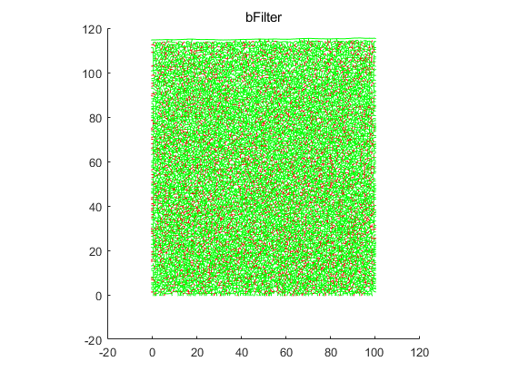
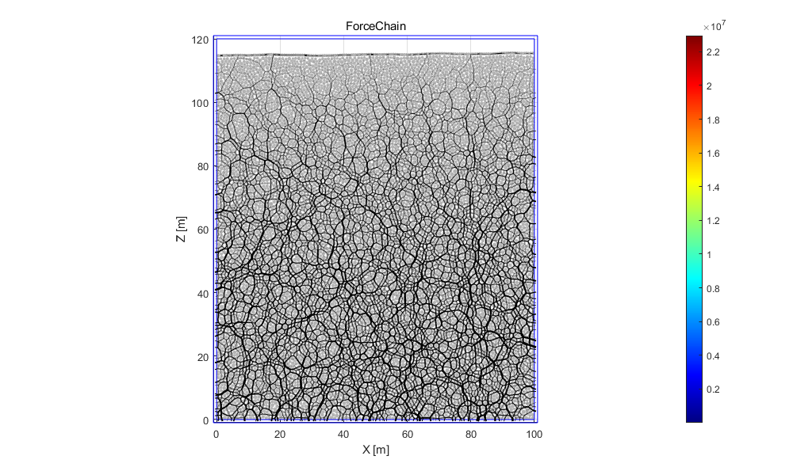
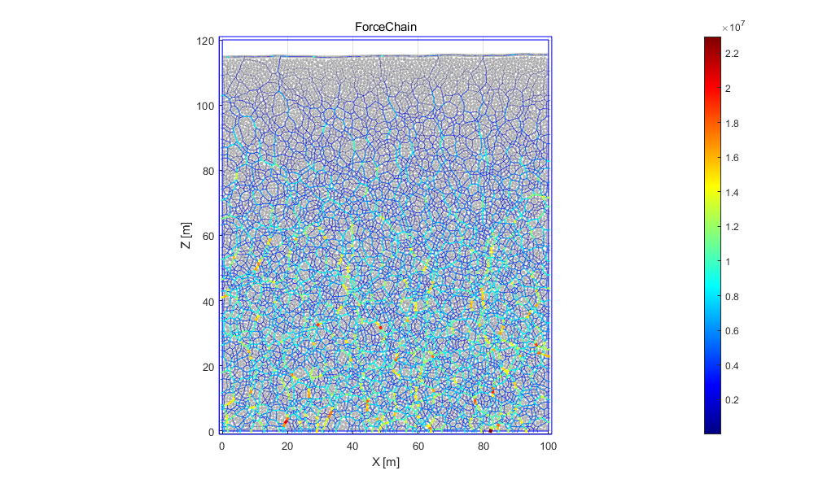
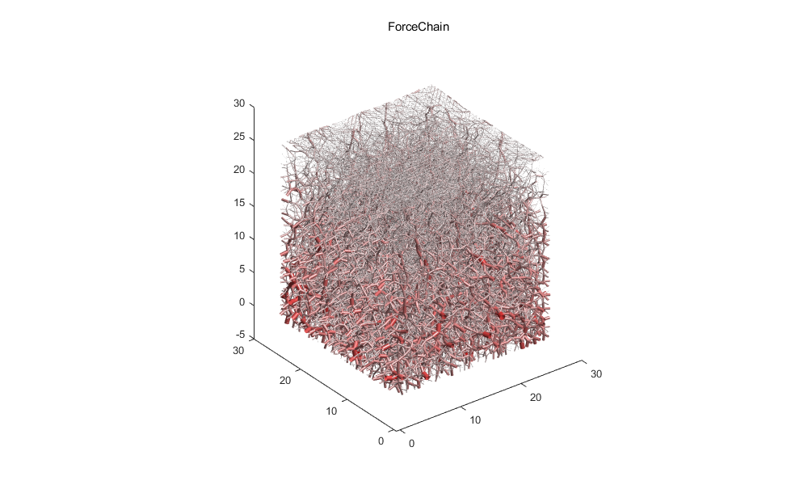
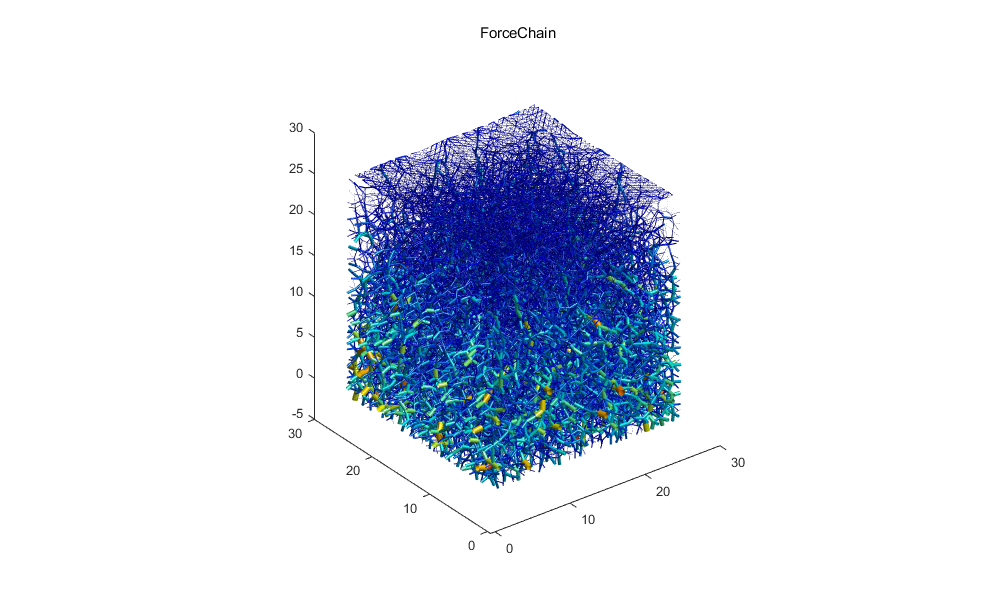
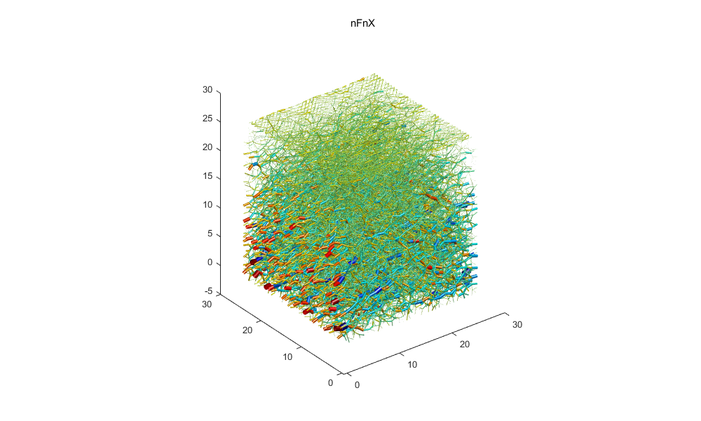

# showC
<!--introduction-->
&#21487;&#35270;&#21270;d&#23545;&#35937;&#30340;&#36830;&#25509;&#25968;&#25454;
<!--/introduction-->
## &#33014;&#32467;
<pre class="codeinput">load('Test2D.mat');
d.calculateData();
d.setUIoutput();

d.mo.bFilter(:)=true;
d.mo.bFilter(1:5:end)=false;
d.mo.zeroBalance();

showC(d, 'bFilter');
snapnow
</pre><pre class="codeoutput">UI output message box is not set in build.setUIoutput
</pre> 
## &#20108;&#32500;&#21147;&#38142;
<pre class="codeinput">load('Test2D.mat');
d.calculateData();
d.setUIoutput();
h = showC(d, 'ForceChain');
snapnow

% &#35843;&#25972;&#37197;&#33394;&#21450;&#30528;&#33394;&#26041;&#24335;
set(h, 'FaceColor', 'flat');
snapnow;
</pre><pre class="codeoutput">UI output message box is not set in build.setUIoutput
Data is set in build.showData
</pre>  
## &#19977;&#32500;&#21147;&#38142;
<pre class="codeinput">load('Test3D.mat');
d.calculateData();
d.setUIoutput();

h = showC(d, 'ForceChain');
</pre><pre class="codeoutput">UI output message box is not set in build.setUIoutput
</pre> 
&#35843;&#25972;colormap
<pre class="codeinput">colormap("jet");snapnow;
</pre> 
## &#20854;&#20182;&#23646;&#24615;&#25968;&#25454;
<pre class="codeinput">load('Test3D.mat');
d.calculateData();
d.setUIoutput();

h = showC(d, 'nFnX');
colormap("jet")
</pre><pre class="codeoutput">UI output message box is not set in build.setUIoutput
</pre> 
 <a href="https://www.mathworks.com/products/matlab/">Published with MATLAB&reg; R2023a</a> 
<link rel="stylesheet" href="../../assets/stylesheets/matlab_publish.css">