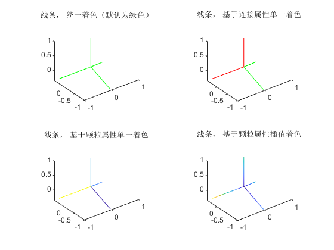
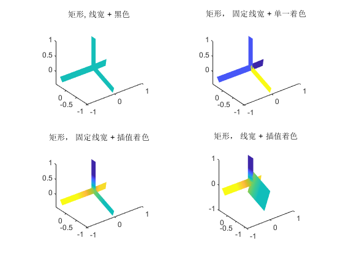
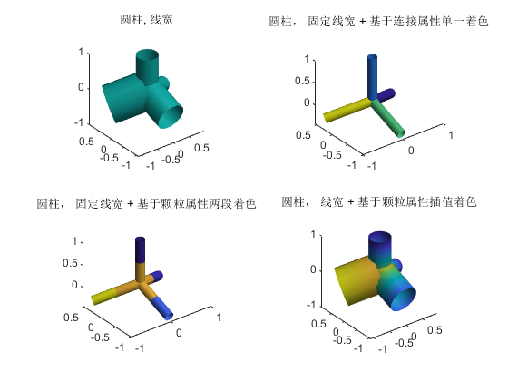
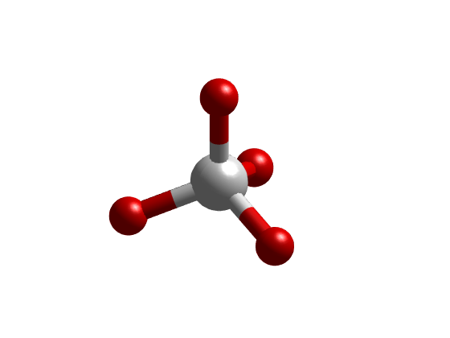
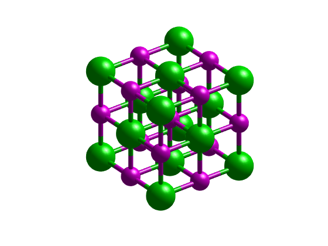
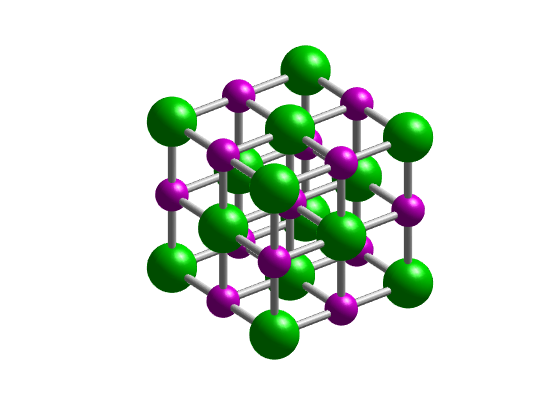

# showConnData
<!--introduction-->
&#21487;&#35270;&#21270;&#39063;&#31890;&#32676;&#30340;&#36830;&#25509;&#29366;&#24577;
<!--/introduction-->
## &#35821;&#27861;
<pre>showConnData(mPos,cList,cW,cC)
showConnData(mPos,cList)
showConnData(mPos,cList,cW)
showConnData(...,M)
showConnData(AX,...)
H = showConnData(...)</pre>
## &#25551;&#36848;

<tt>showConnData(mPos, cList)</tt> visualize connections defined by the points (mPos) and point pairs(cList). Mark with LINE, with the same width and black color.

<tt>showConnData(mPos, cList, cW)</tt> visualize connections, mark with a narrow RECTANGLE or TUBE of different width. The width varies with cW.

<tt>showConnData(mPos, cList, cW, cC)</tt> visualize connections, mark with a narrow RECTANGLE or TUBE of different width and different color. The width varies with cW, the color varies with cC. TODO: interp color along each connection.

<tt>showConnData(__, M)</tt> visualize with the marker M('line','rect','tube')

<tt>showConnData(AX, __)</tt> plots into AX instead of GCA

<tt>H = showConnData(__)</tt> returns a PATCH or SURFACE handle in H.

<tt>__ = showConnData(__, pvpairs)</tt> sets the value of the specified surface property.  Multiple property values can be set with a single statement.

## &#31034;&#20363;&#8212;&#8212;&#22522;&#26412;&#22270;&#20803;&#19982;&#25968;&#25454;&#21487;&#35270;&#21270;

## &#32447;&#26465;(1&#32500;)

&#26080;&#32447;&#23485;&#65292; &#25968;&#25454;&#21487;&#35270;&#21270;&#26102;&#20165;&#26144;&#23556;&#20026;&#39068;&#33394;
<pre class="codeinput">mPos = [zeros(1,3);[sqrt(8)/3*cosd(30:120:270)',sqrt(8)/3*sind(30:120:270)',zeros(3,1)-1/3];0,0,1];
cList = [1,2;1,3;1,4;1,5];
mValue = rand(5,1);
cValue = rand(4,1);

nexttile
showConnData(mPos, cList, 'line');
title('&#32447;&#26465;&#65292; &#32479;&#19968;&#30528;&#33394;&#65288;&#40664;&#35748;&#20026;&#32511;&#33394;&#65289;');
nexttile
showConnData(mPos, cList, 0, cValue, 'EdgeColor', 'flat');
colormap(gca, [0,1,0;1,0,0]);
title('&#32447;&#26465;&#65292; &#22522;&#20110;&#36830;&#25509;&#23646;&#24615;&#21333;&#19968;&#30528;&#33394;');
nexttile
showConnData(mPos, cList, 0, mValue);
title('&#32447;&#26465;&#65292; &#22522;&#20110;&#39063;&#31890;&#23646;&#24615;&#21333;&#19968;&#30528;&#33394;');
nexttile
showConnData(mPos, cList, 0, mValue,'EdgeColor','interp');
title('&#32447;&#26465;&#65292; &#22522;&#20110;&#39063;&#31890;&#23646;&#24615;&#25554;&#20540;&#30528;&#33394;');
</pre> 
## &#30697;&#24418;&#65288;2&#32500;&#65289;

&#25968;&#25454;&#21487;&#35270;&#21270;&#26102;&#21487;&#26144;&#23556;&#20026;&#23485;&#24230;&#12289;&#39068;&#33394;&#25110;&#65288;&#36879;&#26126;&#24230;&#65289;
<pre class="codeinput">mPos = [zeros(1,3);[sqrt(8)/3*cosd(30:120:270)',sqrt(8)/3*sind(30:120:270)',zeros(3,1)-1/3];0,0,1];
cList = [1,2;1,3;1,4;1,5];
mValue = rand(5,1);
cValue = rand(4,1);

figure;
nexttile
showConnData(mPos, cList, 'rect');
title('&#30697;&#24418;, &#32447;&#23485; + &#40657;&#33394;');
nexttile
showConnData(mPos, cList, 1, cValue, 'rect', 'FaceColor', 'flat');
title('&#30697;&#24418;&#65292; &#22266;&#23450;&#32447;&#23485; + &#21333;&#19968;&#30528;&#33394;');
nexttile
showConnData(mPos, cList, 1, mValue, 'rect');
title('&#30697;&#24418;&#65292; &#22266;&#23450;&#32447;&#23485; + &#25554;&#20540;&#30528;&#33394;');
nexttile
showConnData(mPos, cList, cValue, mValue, 'rect','FaceColor','interp');
title('&#30697;&#24418;&#65292; &#32447;&#23485; + &#25554;&#20540;&#30528;&#33394;');
snapnow;
</pre> 
## &#22278;&#26609;

&#25968;&#25454;&#21487;&#35270;&#21270;&#26102;&#21487;&#26144;&#23556;&#20026;&#23485;&#24230;&#12289;&#39068;&#33394;&#25110;&#65288;&#36879;&#26126;&#24230;&#65289; &#19977;&#32500;&#26102;&#21487;&#32771;&#34385;&#20809;&#29031;&#22686;&#24378;&#31435;&#20307;&#24863;
<pre class="codeinput">figure;
mPos = [zeros(1,3);[sqrt(8)/3*cosd(30:120:270)',sqrt(8)/3*sind(30:120:270)',zeros(3,1)-1/3];0,0,1];
cList = [1,2;1,3;1,4;1,5];
mValue = rand(5,1);
cValue = rand(4,1);

nexttile
showConnData(mPos, cList, cValue);
camlight;
title('&#22278;&#26609;, &#32447;&#23485;');
nexttile
showConnData(mPos, cList, 1, cValue,'FaceColor', 'flat');
camlight;
title('&#22278;&#26609;&#65292; &#22266;&#23450;&#32447;&#23485; + &#22522;&#20110;&#36830;&#25509;&#23646;&#24615;&#21333;&#19968;&#30528;&#33394;');
nexttile
showConnData(mPos, cList, 1, mValue);
camlight;
title('&#22278;&#26609;&#65292; &#22266;&#23450;&#32447;&#23485; + &#22522;&#20110;&#39063;&#31890;&#23646;&#24615;&#20004;&#27573;&#30528;&#33394;');
nexttile
showConnData(mPos, cList, cValue, mValue,'FaceColor','interp');
camlight;
title('&#22278;&#26609;&#65292; &#32447;&#23485; + &#22522;&#20110;&#39063;&#31890;&#23646;&#24615;&#25554;&#20540;&#30528;&#33394;');
snapnow;
</pre> 
## CH4&#29699;&#26829;&#27169;&#22411;
<pre class="codeinput">mPos = [zeros(1,3);[sqrt(8)/3*cosd(30:120:270)',sqrt(8)/3*sind(30:120:270)',zeros(3,1)-1/3];0,0,1];
cList = [1,2;1,3;1,4;1,5];
mValue = [2,1,1,1,1]';

figure
s = struct('X',mPos(:,1),'Y',mPos(:,2),'Z',mPos(:,3),'R',0.2*[1.5;ones(4,1)],'groupId',mValue);
bfs.show(s);

hold on
showConnData(mPos, cList, 1, mValue, 'tube','FaceLighting','gouraud');
colormap([1,0,0;1,1,1]);axis off;
hold off;
% snapnow;
</pre> 
## NaCl&#29699;&#26829;&#27169;&#22411;
<pre class="codeinput">n=3;
[mX,mY,mZ]=ndgrid(1:n);
mPos=[mX(:),mY(:),mZ(:)];

mI=reshape(1:length(mPos),size(mX));
cList=[reshape(mI(1:end-1,:,:),[],1),reshape(mI(2:end,:,:),[],1);
    reshape(mI(:,1:end-1,:),[],1),reshape(mI(:,2:end,:),[],1);
    reshape(mI(:,:,1:end-1),[],1),reshape(mI(:,:,2:end),[],1)];

mValue =  mod(mI(:),2)+1;
s = struct('X',mPos(:,1),'Y',mPos(:,2),'Z',mPos(:,3),'R',0.2*(mValue/2+0.5),'groupId',mValue);

% subplot(1,2,1)
bfs.show(s);
hold on
showConnData(mPos, cList, 1/2, mValue,'FaceLighting','gouraud');
colormap([1,0,1;0,1,0]);axis off;
hold off;
snapnow;

% subplot(1,2,2)
bfs.show(s);
hold on
h = showConnData(mPos, cList, 1/2, 3,'FaceLighting','gouraud');
colormap([1,0,1;0,1,0;1,1,1]);axis off;
hold off;
snapnow;

%}
</pre>  
## &#21478;&#35831;&#21442;&#38405;

coneplot, scatter, scatter3

Copyright 2018-2024 The MatDEM teams.

 <a href="https://www.mathworks.com/products/matlab/">Published with MATLAB&reg; R2023a</a> 
<link rel="stylesheet" href="../../assets/stylesheets/matlab_publish.css">