# 后处理

## 绘图接口

???+ note "`d.show`"

    **说明**
    :   
    显示模型参数、模拟过程和模拟结果

    **语法**
    :   
    `d.show()`  
    `d.show(showType)`  
    `d.show(showType1, showType2)`  
    `d.show(showType1, showType2, showType3)`  
    `d.show(showType1, showType2, showType3, showType4)`  
    `figN = d.show(__)`

    **参数**        
    :   
    `showType`  
    `figN`

    **示例**
    :   
    - `d.show('StressXX')`，显示X方向正应力
    - `d.show('StressXX','StressZZ')`，显示X方向正应力与Z方向正应力
    - `d.show()`，显示`d.show('StressZZ','EnergyCurve','ForceCurve','HeatCurve')`的结果
    - `d.show('-StressXX')`，同时显示连接和应力状态

    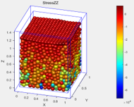
    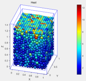

    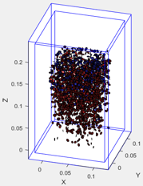
    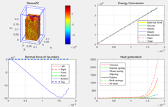

    **参数说明**
    :   
    - 模拟结果，数据来源：`d.data.*`  
        `#!matlab showType: ['StressXX' | 'Displacement' ...]`
    - 单元参数，数据来源：`d.mo.*`  
        `#!matlab showType: ['aX' | 'mGZ' ...]`
    - 模拟过程，数据来源：`d.status.*`  
        `#!matlab showType: ['ForceCurve' | 'EnergyCurve' ...]`
    - 自定义参数，数据来源：`d.mo.SET.*`     
    - 一些特别的绘图  
        `#!matlab showType: ['--' | 'Id' | 'Crack' ...]`

???+ note "`d.showBall`"

    **语法**

    :   `d.showBall(Id)`  

    **说明**

    :   显示单元在模型中的位置，以及与周围单元的作用力图。  
    输入参数为单元编号，返回值为此单元所受应力

    **示例**

    :   `d.showBall(111)`     
    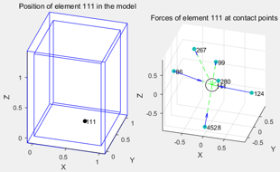    
## 绘图控制

???+ "`d.showFilter`"

    **说明**

    :   根据一定筛选规则（坐标、单元组名等）选择特定单元进行显示  
    此函数更新d.data.showFilter属性，供d.show函数查询控制绘图  
    此函数的效果 **可多次叠加**
    
    **语法**

    :   `d.showFilter(filterType, filterValue)`  
        `d.showFilter(filterType, filterValue1, filterValue2)`  
        `d.showFilter(__, showType)`  
        `d.showFilter()`  
        `showFilter = d.showFilter(__)`

    **示例**
    
    :   `filterType`: `#!matlab ['Slide' | 'SlideX' | 'SlideY' | 'SlideZ' | 'Group' | 'Filter' | 'BallId']`  			
	
        `#!matlab d.showFilter('Slide',0.5,'aR');`
        在x,y,z方向上同时切，得到一个块，第2个参数`filterValue`为切割块比率

        `#!matlab d.showFilter('SlideX',0.2,0.6,'aR');`
        在x方向切割，第2-3个参数`filterValue`为起始位置和厚度，值在0-1间。
        
        `#!matlab 'SlideY', 'SlideZ'`   同`#!matlab 'SlideX'`		

        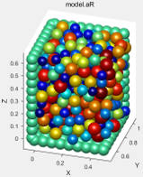
        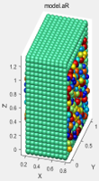

        `#!matlab d.showFilter('Material',1,'aR');`
        显示指定材料号的单元, 第2个参数`filterValue`为材料编号

        `#!matlab d.showFilter('BallId',[1,50,100],'aR');`
        显示指定编号的单元, 第2个参数`filterValue`为单元编号数组	
      	
        `#!matlab d.showFilter('Group',{'sample','lefB'},'aR');`
        显示指定组的单元，第2个参数`filterValue`为组名的cell数组	

        `#!matlab 'Filter'` 直接赋新的`showFilter`
        第2个参数`filterValue`为`showFilter`布尔矩阵，长度为`aNum`

???+ "`d.showB`"

    **说明**
    :   
    控制显示边界及墙单元的方式。  
    墙单元在计算时不移动，默认六个边界为墙单元，其边框根据模型的六个边界位置来定义。  
    在显示边界单元时，`d.showB`属性和`d.showFilter`函数效果相叠加	

    **用法**
    :   
    `d.showB=0` 不显示固定的墙单元（包括边界单元）和边框线  
    `d.showB=1` 仅显示边框线  
    `d.showB=2` 显示所有固定的墙单元（包括边界单元）  
    `d.showB=3` 不显示边界单元，但显示自定义的墙单元  
    `d.showB=4` 将显示区域控制在d.mo.frame中，用于[行星案例]显示

    
    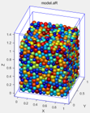
    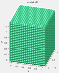
    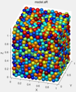
    
    <figure markdown>
      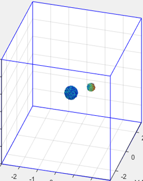{width=100px}
      <figcaption>`d.showB=4`</figcaption>
    </figure>

???+ "`d.status.lengendLocation`"

    **说明**
    :   
    控制图例位置, `#!matlab ['West' | 'East' | ...]`

???+ "`d.figureNumber`"

    **说明**
    :   
    控制绘图窗口  
    运行`#!matlab ufs.simpleFigure('on');`后，会启用简单绘图，不显示图例。具体见[roller3]示例

## 图件绘制和数据保存

采用以下命令将数据保存在excel文档中  
`#!matlab xlswrite('stress.xls',d.data.StressZZ);`		

## GIF动图生成
